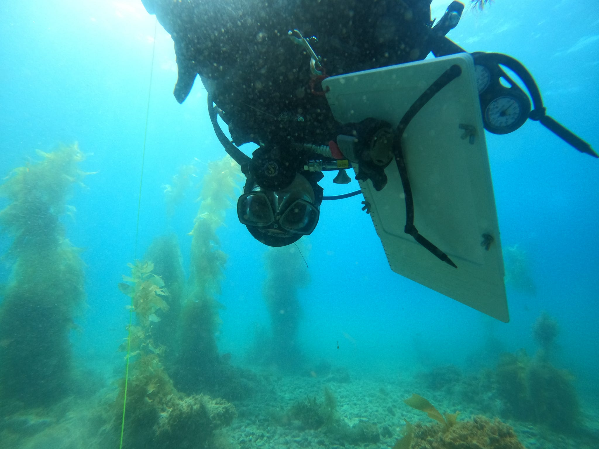
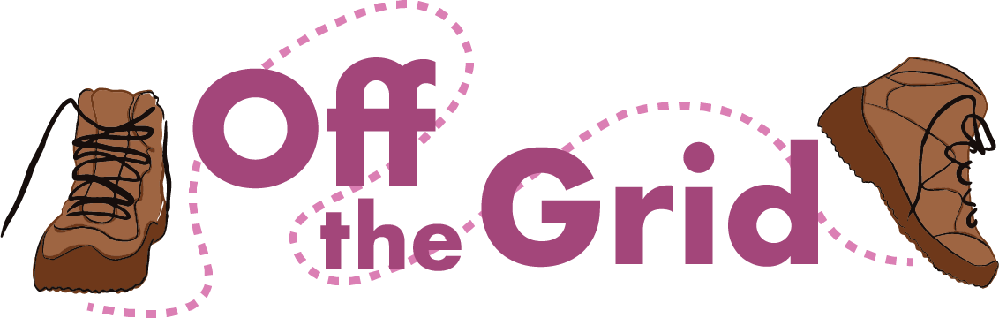
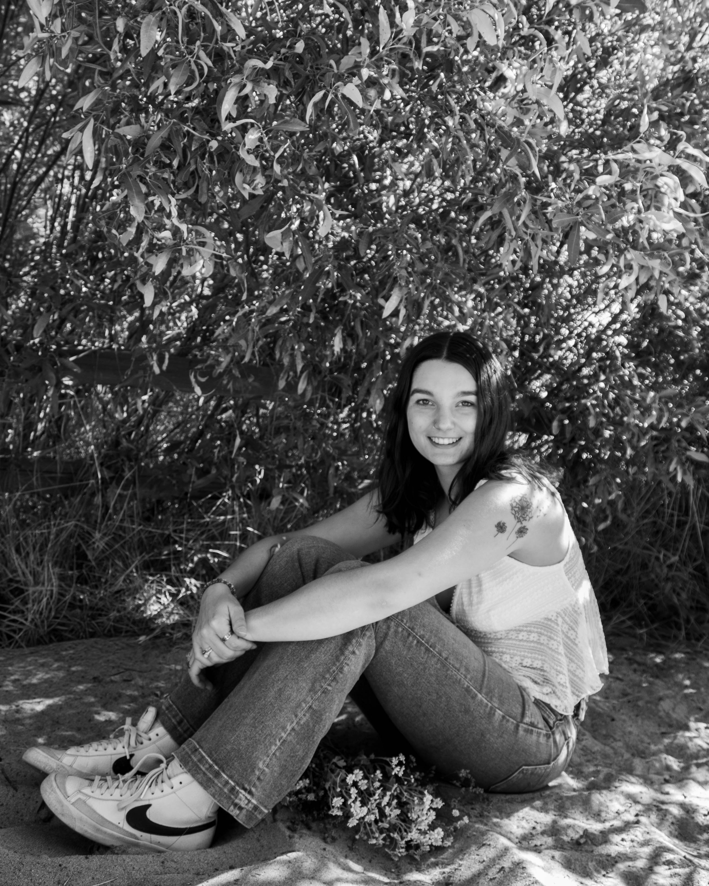

# Introduction 

::: {.columns}

::: {.column width="45%"}

{width=100%}

::: {.callout-note}
## Background
Hi there! I am an Environmental Studies student at UCSB from Coloma, CA. I am a first-generation college student working toward a B.S. degree, with plans to pursue a Master’s degree.
:::

:::

::: {.column width="55%"}

## 🌱 Overview

::: {.callout-important}
### Interests
- Ecology  
- Climate change  
- Data science  
:::

::: {.callout-tip}
### Favorites
- 🐋 Animal: Orca  
- 🌍 Place: Big Sur, CA / Iceland  
- 🎯 Dream Job: Whale Researcher / Marine Biologist  
:::

:::

:::

---

# 🌿 Personal Life & Activities

::: {.columns}

::: {.column width="60%"}

::: {.callout-note}
I enjoy hiking, being outdoors, and spending time between the mountains and the ocean. I also paint, draw, and create floral, landscape, and marine-themed artwork.
:::

::: {.callout-important}
During my time at UCSB, I became President of an all-women’s outdoor club called **Off The Grid**, which focuses on breaking down financial barriers to outdoor activities such as backpacking, camping, surfing, climbing, and hiking.
:::

::: {.callout-tip}
This leadership role has helped me develop skills in organization, communication, and balancing academics with extracurricular responsibilities.
:::

:::

::: {.column width="40%"}

{width=100%}

{width=100%}

:::

:::

{style="width:200px; border:5px solid #3f5f45; border-radius:50%;"}
---

# 🌊 What Drives Me

::: {.callout-note}
I am motivated by connecting people to nature and encouraging active, outdoor lifestyles. I hope to use my education to contribute to marine research and conservation efforts.
:::