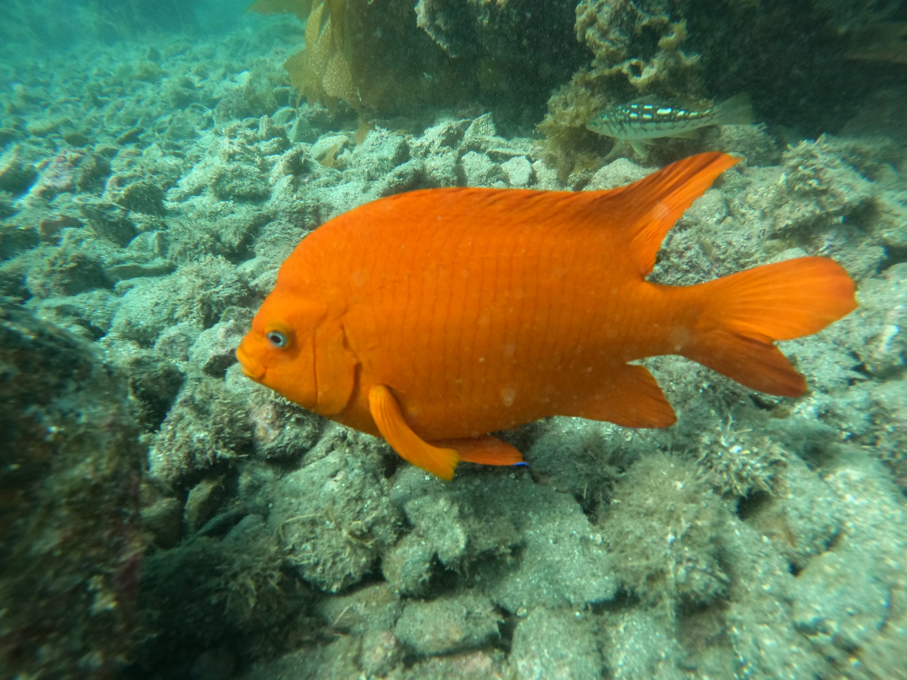

::: {.callout-note}
# Diving Certifications 
- NAUI Open Water Scuba Diver 
- NAUI Open Water Scuba Diver
- NAUI Rescue Diver 
- NAUI Nitrox Diver 
- AAUS Lead Diver 
- AAUS Scientific Diving 
- Diver's Alert Network First Aid, CPR/O2 
:::

::: {.callout-note}
# About My Diving Experience
I have completed over 20 dives along the Santa Barbara coastline including
recreational, training, and scientific diving focusing on kelp forest ecosystems and
marine biodiversity.
:::
# Scuba Diving Photography 

{width=60% height=60%}

*Garibaldi Fish at Refugio State Beach, March 2026* 

{width=50% height=60%}
*Anacapa Island Kelp Forest, November 2025* 

# Dive Site Interactive Map

<link rel="stylesheet"
href="https://cdnjs.cloudflare.com/ajax/libs/font-awesome/6.5.1/css/all.min.css">

<!-- Load Leaflet CSS -->
<link rel="stylesheet" href="https://unpkg.com/leaflet/dist/leaflet.css"/>

<!-- Load Leaflet JavaScript -->

## Map Code

The code used to create this interactive map can be found in my GitHub repository:

[View Map Code on GitHub](https://github.com/kierramiller/kierramiller.github.io)
