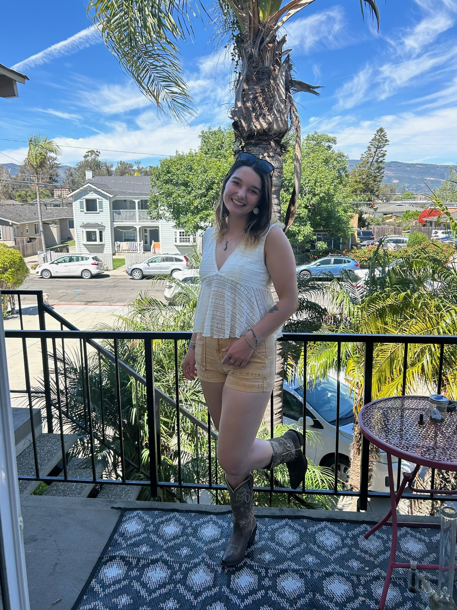
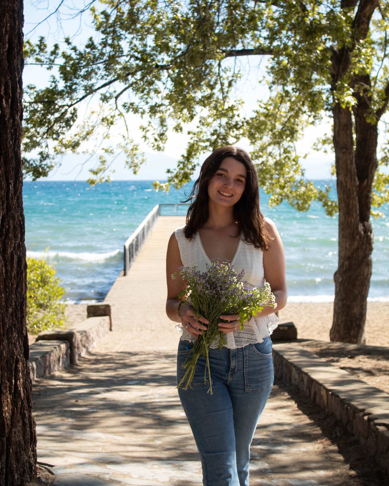

:::: {.columns}

::: {.column width="60%"}

## Hi, I'm Kierra

I am an Environmental Studies student focused on marine and forest ecology, I plan on continuing my studies in Coastal Science and and Ecology. I spend my time enjoying many hobbies including painting, backpacking, surfing, and scuba diving.

I am passionate about understanding ocean ecosystems and working in an outdoor 
environment. 

:::

::: {.column width="40%"}

{.circle-img width=260px}

:::

::::

:::: {.columns}

::: {.column width="50%"}

{.square-img}

:::

::: {.column width="50%"}

## About Me

- Marine ecology focus  
- Intermediate scuba diver  
- Interested in Kelp Forest Ecology
- Experience in Data Visualization and Analysis 

:::

::::