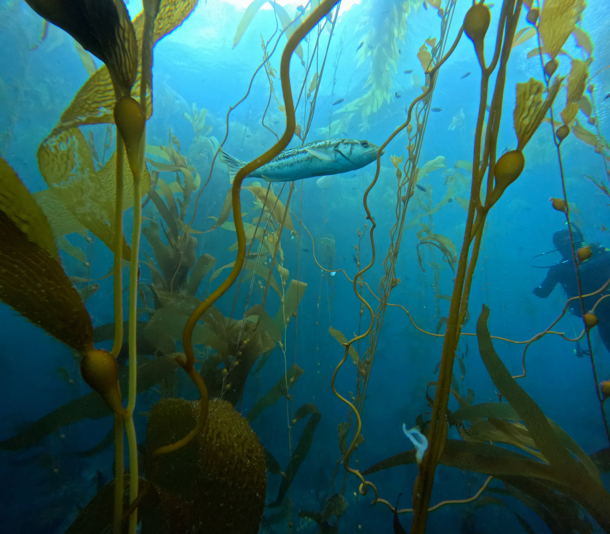
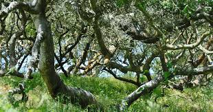

I am interested in marine ecosystems, ecological change, and environmental data analysis.

<!-- ===================== -->
<!-- PROJECT 1 -->
<!-- ===================== -->

  

  <h3>Urchin Abundance Research Experiment</h3>
  
SBC LTER Experiment

  

    Field-based ecological monitoring of sea urchin populations along the Santa Barbara coastline.
  

  <!-- DROPDOWN DETAILS -->
  

    
More details

    

      This project is part of the Santa Barbara Coastal Long Term Ecological Research (SBC LTER)
      program. I work alongside team members to conduct biweekly experiments at multiple coastal
      sites. Data include larval settlement rates, dietary composition effects on growth and gonad
      development, fertilization success, and forage rate across long-term time series datasets.
    

  

  <a href="urchin.pdf" target="_blank" class="button">
    View Project PDF
  </a>

<!-- ===================== -->
<!-- PROJECT 2 -->
<!-- ===================== -->

  

  <h3>Coast Live Oak Gall Growth Experiment</h3>
  
Ecosystem Change Project

  

    A 9-week field experiment analyzing gall formation and ecosystem response in Coast Live Oak trees.
  

  <!-- DROPDOWN DETAILS -->
  

    
More details

    

      This class-based research project investigated how abiotic factors influence gall formation
      and grass growth. We tested environmental drivers of plant–insect interactions and quantified
      variation across sites in Isla Vista, CA using observational and experimental data collection.
    

  

  <a href="ecp.pdf" target="_blank" class="button">
    View Project PDF
  </a>

